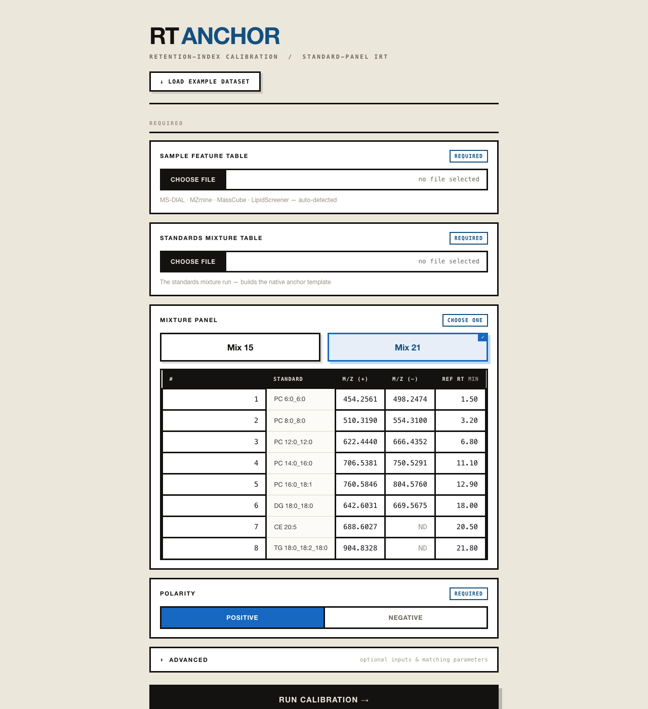
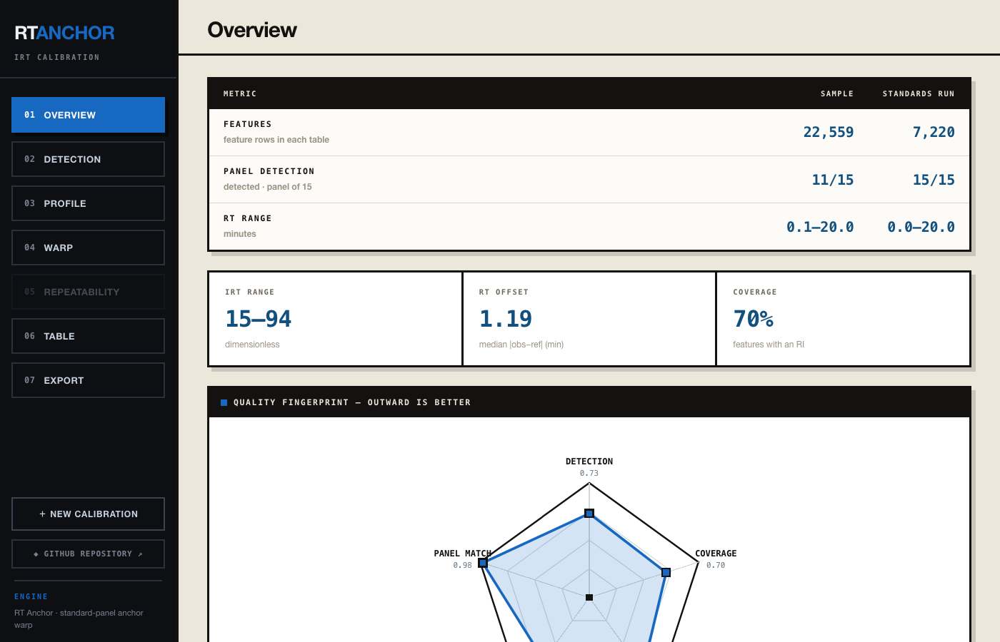
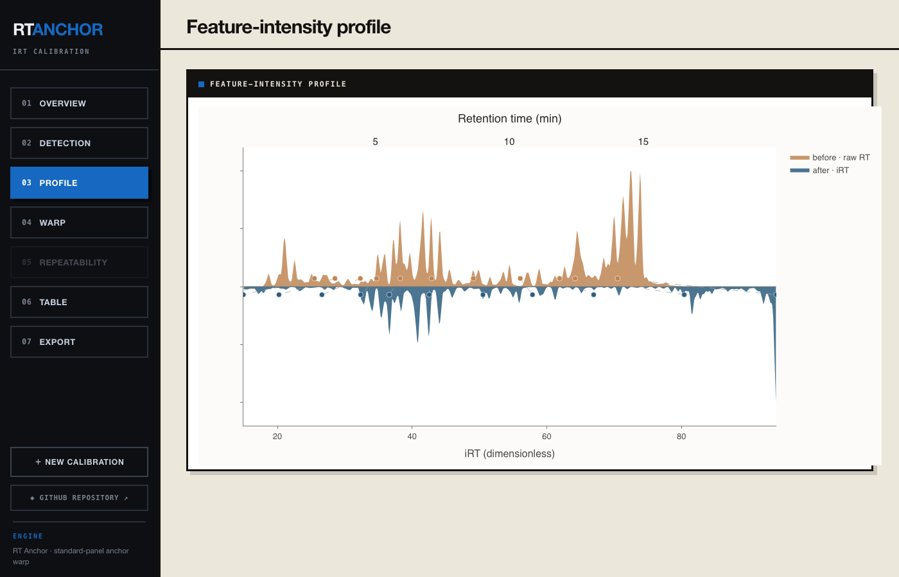

# RT Anchor

Standard-panel **retention-index (iRT) calibration** for LC-MS lipidomics

## Purpose

Convert the retention time of every feature in an LC-MS table into a
dimensionless, portable **retention index (RI / iRT)** anchored on a spiked
standard panel, so retention is comparable across injections, batches, and
instruments. The original table is never altered — calibration only appends columns.

## Download

- **Python package:** `pip install rt-anchor` — [`rt-anchor` on PyPI](https://pypi.org/project/rt-anchor/)
- **macOS desktop app:** download the `.dmg` from the [**latest release**](https://github.com/Bowen999/rt-anchor/releases/latest), open it, and drag **RT Anchor** to Applications. On first launch, right-click → **Open** (the app is signed but not yet notarized).

## Input

The desktop app asks for:

 * a **sample feature table** — needs an *m/z* and a retention-time column (MS-DIAL · MZmine · MassCube · LipidScreener, auto-detected)
 * a **standards mixture table** — the run of your standard mixture, which builds the native anchor template
 * a **mixture panel** — **Mix 15** or **Mix 21**, the two bundled standard panels; a per-standard preview table (m/z per polarity · reference RT) helps pick the right one
 * the **polarity** (`positive` / `negative`).

Optional: per-injection files (per-sample tier + repeatability QC) and matching
parameters (`mz_tol_ppm`, `rt_window_min`, `min_anchors`, `extrapolate`). With
the engine API, a custom manifest / reference baseline can still be passed to
`calibrate()`.

Supported feature-table formats: [MZmine](https://mzio.io/mzmine-news/) ·
[MS-DIAL](https://systemsomicslab.github.io/compms/msdial/main.html) ·
[MassCube](https://huaxuyu.github.io/masscubedocs/) ·
[Lipidscreener](https://tmiclinode.com/web-servers-software/).

## Output

- **`*_calibrated.csv`** — original table + `RI`, `RI_uncertainty`, `RI_reliability`,
  `RI_spread`, `n_contributing`, `is_extrapolated`, `calibration_scope`, `warp_source`.
- **`*_model.json`**, **`*_anchors.csv`**, **`*_log.txt`** — the fitted model, anchors, and log.
- **`*_report.html`** + **`*_report.pdf`** — interactive + static report (on by default).

## Examples

- [`examples/quickstart.ipynb`](examples/quickstart.ipynb) — a Jupyter notebook running the bundled Mix 15 example end-to-end.
- [`examples/input_15_mixture/`](examples/input_15_mixture/) — example sample + standards tables for the **Mix 15** panel.
- [`examples/input_21_mixture/`](examples/input_21_mixture/) — example sample + standards tables for the **Mix 21** panel.
- [`examples/output/`](examples/output/) — the generated CSV, model, anchors, log, and HTML/PDF report.

## How calibration works

Retention time drifts between injections, batches, and instruments, which makes
features hard to compare across runs. RT Anchor removes that drift by mapping each
feature's retention time onto a dimensionless **retention index (RI)** — the similar
principle as a Kováts index in GC, adapted to reversed-phase LC with a spiked lipid
standard panel.

A panel of standards spanning the gradient is run alongside the samples. Each
standard is located in the **standards run** by its *m/z* (and, where available,
MS² and intensity), pairing its **observed** retention time with a **fixed reference
index**. A shape-preserving **monotone spline (PCHIP)** is fitted through these
anchor points and applied to every feature, converting retention time → retention
index on a scale fixed by two reference times (making the index instrument-independent).

Every feature is reported with its RI, a per-feature **uncertainty**, and a **reliability**
tier; supplying per-injection tables additionally yields a run-to-run **spread**
(repeatability QC).

# Bug Report
If you have any questions or encounter any bugs, please contact Bowen Yang (by8@ualberta.ca).
