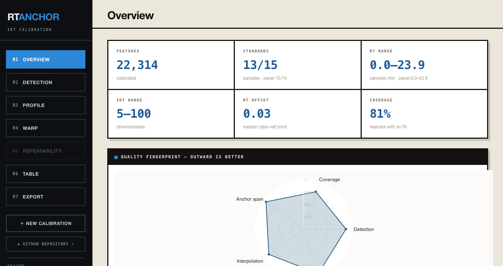

# RT Anchor

Standard-panel **retention-index (iRT) calibration** for LC-MS lipidomics — a
Python package ([`rt-anchor`](https://pypi.org/project/rt-anchor/)) and a macOS desktop app.

## Purpose

Convert the retention time of every feature in an LC-MS table into a
dimensionless, portable **retention index (RI / iRT)** anchored on a spiked
standard panel, so retention is comparable across injections, batches, and
instruments. The original table is never altered — calibration only appends columns.

## How calibration works

Retention time drifts between injections, batches, and instruments, which makes
features hard to compare across runs. RT Anchor removes that drift by mapping each
feature's retention time onto a dimensionless **retention index (RI)** — the same
principle as a Kováts index in GC, adapted to reversed-phase LC with a spiked lipid
standard panel.

A panel of standards spanning the gradient is run alongside the samples. Each
standard is located in the **standards run** by its *m/z* (and, where available,
MS² and intensity), pairing its **observed** retention time with a **fixed reference
index**. A shape-preserving **monotone spline (PCHIP)** is fitted through these
anchor points and applied to every feature, converting retention time → retention
index on a scale fixed by two reference times (making the index instrument-independent).
Because the warp is monotone it preserves elution order and never fabricates values —
features beyond the outermost anchors are flagged rather than extrapolated. Every
feature is reported with its RI, a per-feature **uncertainty**, and a **reliability**
tier; supplying per-injection tables additionally yields a run-to-run **spread**
(repeatability QC).

## Download

- **Python package:** `pip install rt-anchor` — [`rt-anchor` on PyPI](https://pypi.org/project/rt-anchor/) (`pip install "rt-anchor[report,structures]"` for the HTML/PDF report + structure hover).
- **macOS desktop app:** download the `.dmg` from the [**latest release**](https://github.com/Bowen999/rt-anchor/releases/latest), open it, and drag **RT Anchor** to Applications. On first launch, right-click → **Open** (the app is signed but not yet notarized).

## Input

Required: a **sample feature table** (MS-DIAL / MZmine / MassCube / LipidScreener,
auto-detected; needs an *m/z* and a retention-time column), a **standards run** of
the panel, and the **polarity** (`positive` / `negative`).

Optional: per-injection files (per-sample tier + repeatability QC), a custom
manifest / reference baseline, and matching parameters (`mz_tol_ppm`,
`rt_window_min`, `min_anchors`, `extrapolate`).

## Output

- **`*_calibrated.csv`** — original table + `RI`, `RI_uncertainty`, `RI_reliability`,
  `RI_spread`, `n_contributing`, `is_extrapolated`, `calibration_scope`, `warp_source`.
- **`*_model.json`**, **`*_anchors.csv`**, **`*_log.txt`** — the fitted model, anchors, and log.
- **`*_report.html`** + **`*_report.pdf`** — interactive + static report (on by default).

## Examples

- [`examples/quickstart.ipynb`](examples/quickstart.ipynb) — a Jupyter notebook running the bundled example end-to-end.
- [`examples/input/`](examples/input/) — example sample + standards tables.
- [`examples/output/`](examples/output/) — the generated CSV, model, anchors, log, and HTML/PDF report.

## Repository layout

- [`rt_anchor/`](rt_anchor/) — the Python package (PyPI: **rt-anchor**).
- [`RT Anchor Desktop/`](RT%20Anchor%20Desktop/) — the macOS desktop app (pywebview + PyInstaller).

## License

MIT
