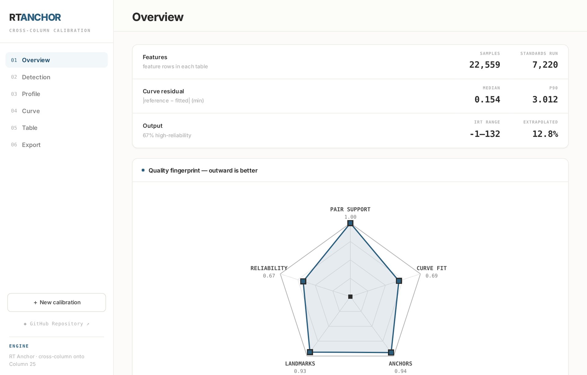
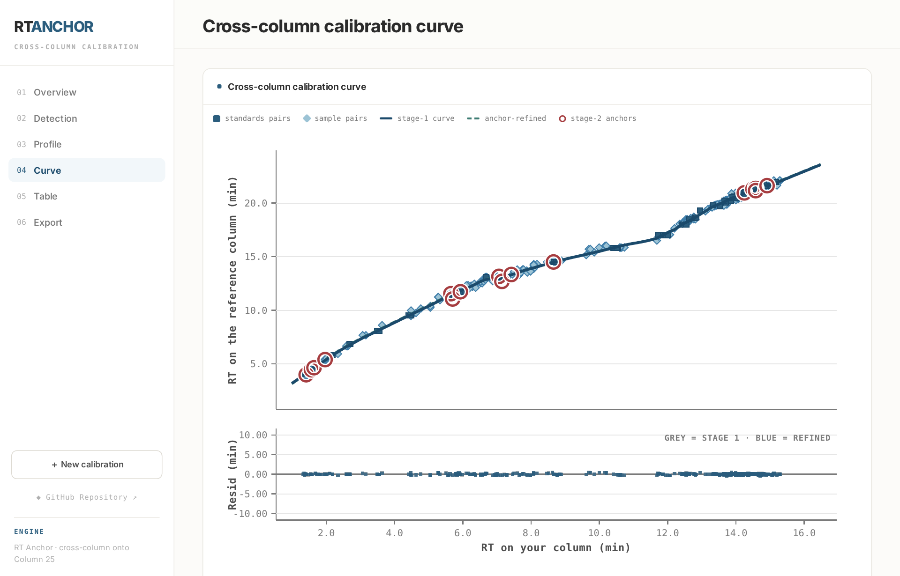
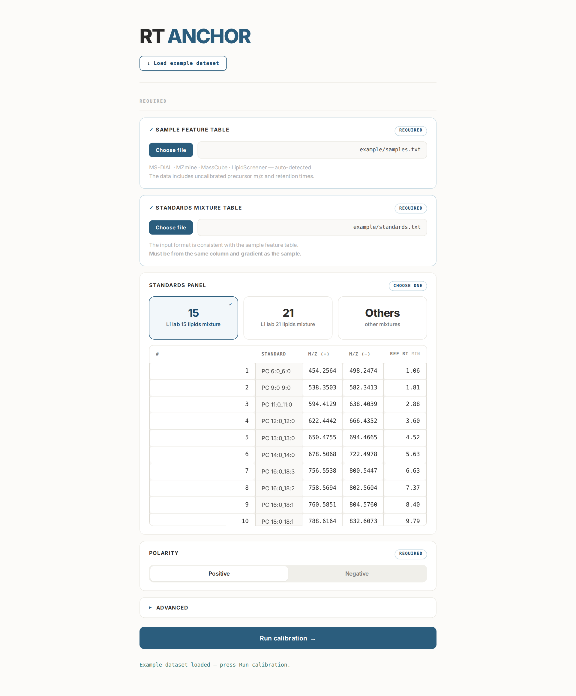
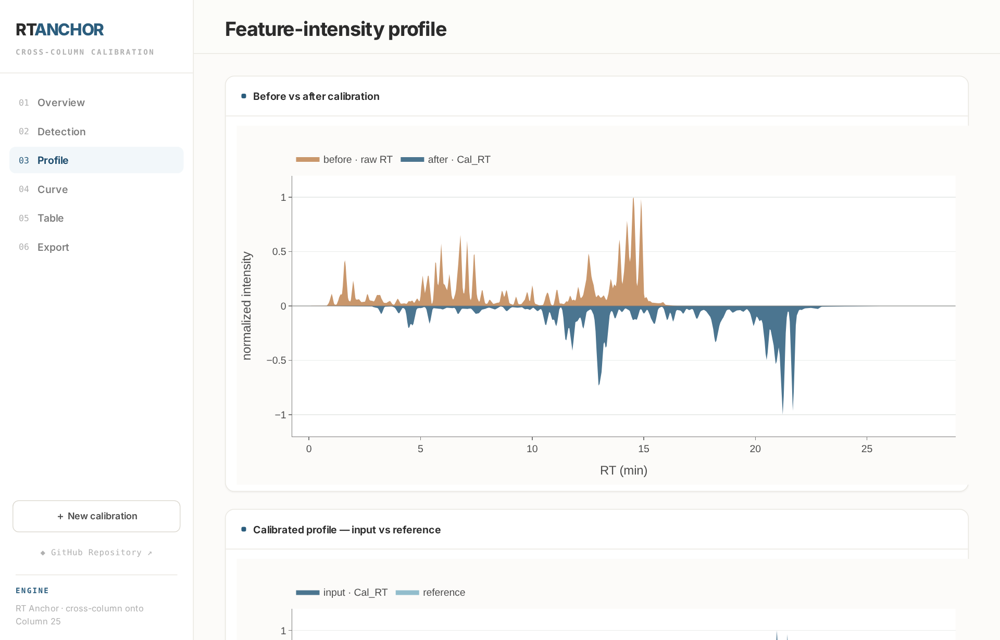

# RT Anchor

**Cross-column retention-time calibration for LC-MS lipidomics.**

RT Anchor puts every feature of an LC-MS run onto a shared time axis: the
retention time it *would have had* on a reference column (`Cal_RT_min`), plus a
dimensionless 1–100 retention index (`iRT`). Retention then becomes comparable
across columns, gradients, instruments and labs. The input table is never
altered — calibration only appends columns.

It ships as a Python package (`rt-anchor`: library, CLI, HTML/PDF report) and as
a desktop app for macOS and Windows.

<p>
  
  
</p>

## Download

- **Desktop app** — from the [**latest release**](https://github.com/Bowen999/rt-anchor/releases/latest):
  - macOS (Apple Silicon): the `.dmg` — drag **RT Anchor** to Applications; on first
    launch right-click → **Open** (the app is ad-hoc signed, not notarized).
  - Windows 10/11 x64: the `win64` `.zip` — unzip anywhere and run `RT Anchor.exe`
    (needs the WebView2 Runtime, preinstalled on Windows 11 and most Windows 10).
- **Python package** — `pip install rt-anchor` ([PyPI](https://pypi.org/project/rt-anchor/));
  add `[report]` for the HTML/PDF report.

## Quick start

```python
from rt_anchor import calibrate, write_results

res = calibrate("samples.txt", polarity="positive",
                standards_table="standards.txt", panel="mix21")
write_results(res, "out/run1")
```

```bash
rt-anchor calibrate --samples samples.txt --standards standards.txt \
                    --polarity positive --panel mix21 --out out/run1
```

A runnable walk-through with bundled data is in
[`examples/quickstart.ipynb`](examples/quickstart.ipynb).

## Inputs and outputs

| Input | |
|---|---|
| **Sample feature table** | the run to calibrate — MS-DIAL · MZmine · MassCube · LipidScreener, auto-detected; needs a precursor *m/z* and a retention-time column |
| **Standards run** | a run of the standards mixture **from the same column and gradient as the sample** |
| **Panel** | `mix15` (15-standard Caley mix), `mix21` (Mix 4.4, 21 standards; default) or `none` |
| **Polarity** | `positive` or `negative` |
| *Reference pair* (optional) | defaults to the bundled reference column (`col35`: human serum + Mix 4.4 standards, QTOF, positive mode) |

Outputs (`write_results`): `*_calibrated.csv` (the input table plus `Cal_RT_min`,
`iRT`, their uncertainties, a reliability tier and an extrapolation flag),
`*_model.json`, `*_pairs.csv`, `*_landmarks.csv`, `*_anchors.csv`, `*_log.txt`,
and an `*_report.html` / `*_report.pdf` report.

## How it works

1. **Stage 1 — anchor-free curve.** Features of your standards run are matched to
   the reference standards run by accurate *m/z* alone (reciprocal best match
   within 15 ppm),
   sample-run pairs are merged in to cover the early and late gradient, and a
   robust monotone curve (LOESS → isotonic → PCHIP, MAD outlier trimming) maps
   your RT onto the reference column. No standard identities are needed.
2. **Stage 2 — gated sample anchors.** Seventeen endogenous plasma lipids found in
   both sample runs refine the curve with a class-aware correction, applied only
   when it cuts leave-one-out error by at least 20%. On other matrices Stage 2
   does not engage and the Stage-1 curve is used.
3. **iRT.** The chosen panel's standards located on the reference standards run
   define the scale: the earliest is 1, the latest 100.

Details, accuracy figures and all parameters: [`rt_anchor/README.md`](rt_anchor/README.md).
The full method specification: [`docs/RI_CALIBRATION_SPEC_V2.md`](docs/RI_CALIBRATION_SPEC_V2.md).

## Repository layout

```
rt_anchor/                 Python package "rt-anchor" (PyPI) — engine, CLI, report
├── src/rt_anchor/
│   ├── pipeline.py        calibrate(): orchestrates the stages below
│   ├── crosscolumn.py     stage 1 — m/z matching + robust monotone curve
│   ├── plasma_lipids.py   stage 2 — endogenous plasma-lipid anchors
│   ├── irt.py             the iRT ruler (panel landmarks on the reference run)
│   ├── reference_data/    bundled reference column (col35) — the default Cal_RT axis
│   ├── io/ · viz/         table loaders (4 formats) · figures + HTML/PDF report
│   └── cli.py · helpers.py   rt-anchor CLI · write_results()
├── tests/                 pytest suite; tests/data/ holds the test datasets
└── pyproject.toml · README.md (the PyPI page)
RT Anchor Desktop/         the desktop app (pywebview) — one source, macOS + Windows builds
examples/                  quickstart notebook · Mix 15 / Mix 21 inputs · example outputs
docs/                      method specification (v2) · screenshots
.github/workflows/         CI — builds the Windows desktop app on v* tags
```

## Desktop app

Pick the two runs, the panel and the polarity, then browse the result sections
(Overview · Detection · Profile · Curve · Table · Export) and export every output
in one click. Build and development notes: [`RT Anchor Desktop/README.md`](RT%20Anchor%20Desktop/README.md).

<p>
  
  
</p>

## Development

```bash
pip install -e "rt_anchor[test,report]"
pytest rt_anchor/tests
```

## Bug report

If you have any questions or encounter any bugs, please contact Bowen Yang (by8@ualberta.ca).
